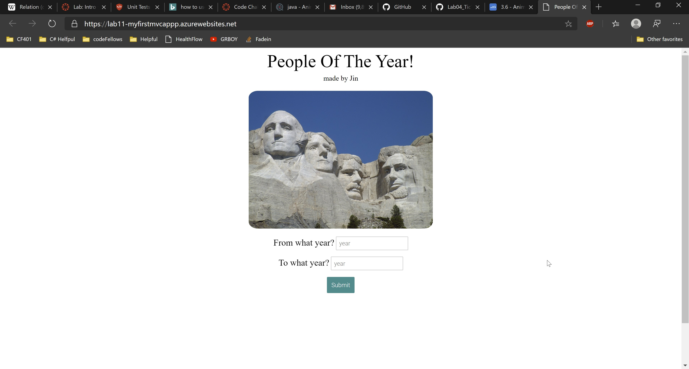
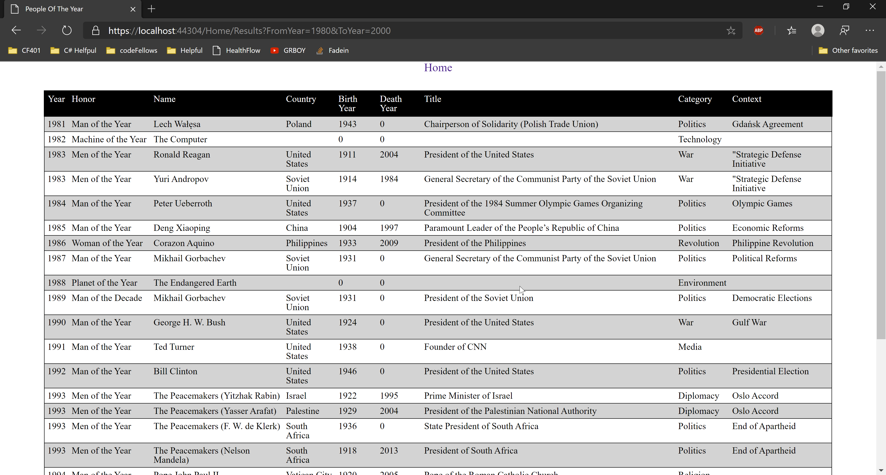

# People of the Year
----

Lab 11 - Intro to MVC & Core

*Author: Jin Kim*

----

## Description

This is web application that created using C# and .Net Framework. Site is deployed on Azure can be search to see in specific time frame, who had chosen to be people of the year.

---
## Dependencies

- [ASP.NET core](https://docs.microsoft.com/en-us/aspnet/core/?view=aspnetcore-3.1)
- [Git](https://git-scm.com/)
- Terminal/ Command line
- [.Net Core SDK](https://dotnet.microsoft.com/download)
- [Visual Studio](https://docs.microsoft.com/en-us/visualstudio/releases/2019/release-notes)

---
### Deployed Website:

https://lab11-myfirstmvcappp.azurewebsites.net/Home

### Getting Started
Clone this repository to your local machine using terminal(macOS), command line(Window).

```
$ git clone https://github.com/jinwoov/Lab11-MyFirstMVCApp.git
```

### To run the program from Visual Studio:
Select ```File``` -> ```Open``` -> ```Project/Solution```

Next navigate to the location you cloned the Repository.

Double click on the ```Lab11-MyFirstMVCApp``` directory.

In the `Lab11-MyFirstMVCApp`, navigate further into `Lab11-MyFirstMVCApp`

Then select and open ```Lab11-MyFirstMVCApp.sln```

### After getting the site to load
When you enter the website enter year time frame that you want to search for and upon submitting the button the result will populate for people who were recognized during that time frame.

---
### Visuals

#### Appliation Running


#### Result Page



---

### Change Log
- 1.5: *README completed and images are added* March 31 2020
- 1.4: *Deployed to Azure* March 31 2020
- 1.3: *Methods and classes are completed and functional* March 31 2020
- 1.2: *Created MVC to manage file and configure server to run homepage* - March 31 2020
- 1.1: *ASP.Net core project set up and added JSON file* - March 31 2020  
- 1.0: *Created Repo, structuralized the folder* - March 31 2020  